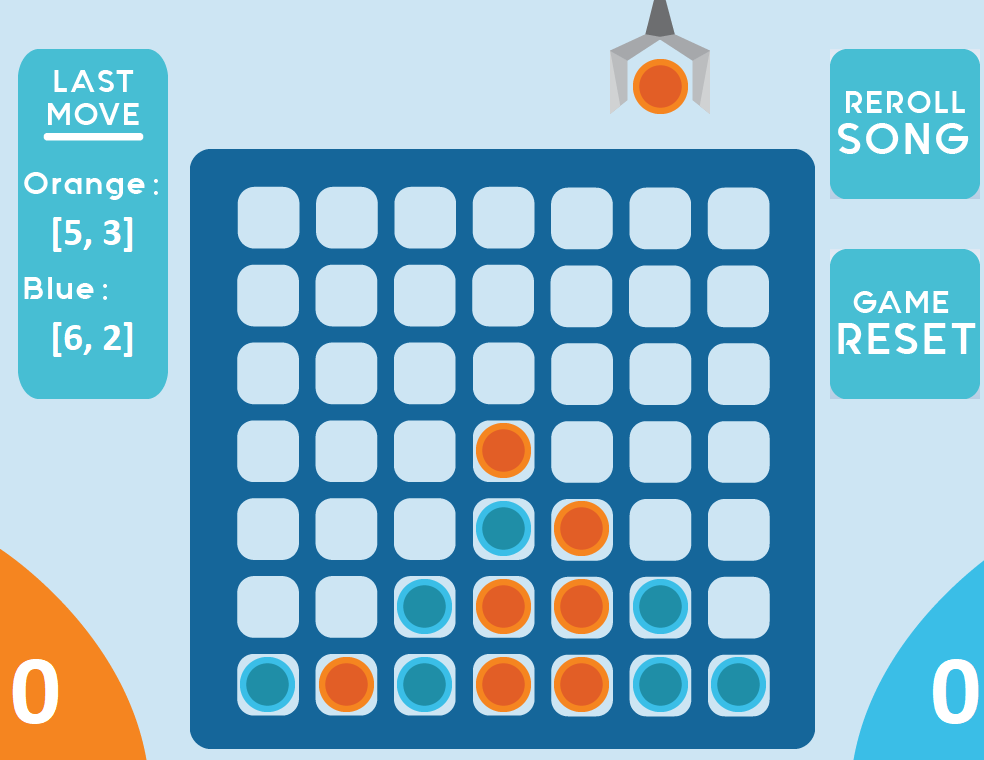

# 4Linkz
Connect 4 game with visually appealing GUI and music component.

Uses object oriented principles to modularize code into various components.

Note: Requires JAVAFX library to run in IntelliJ

