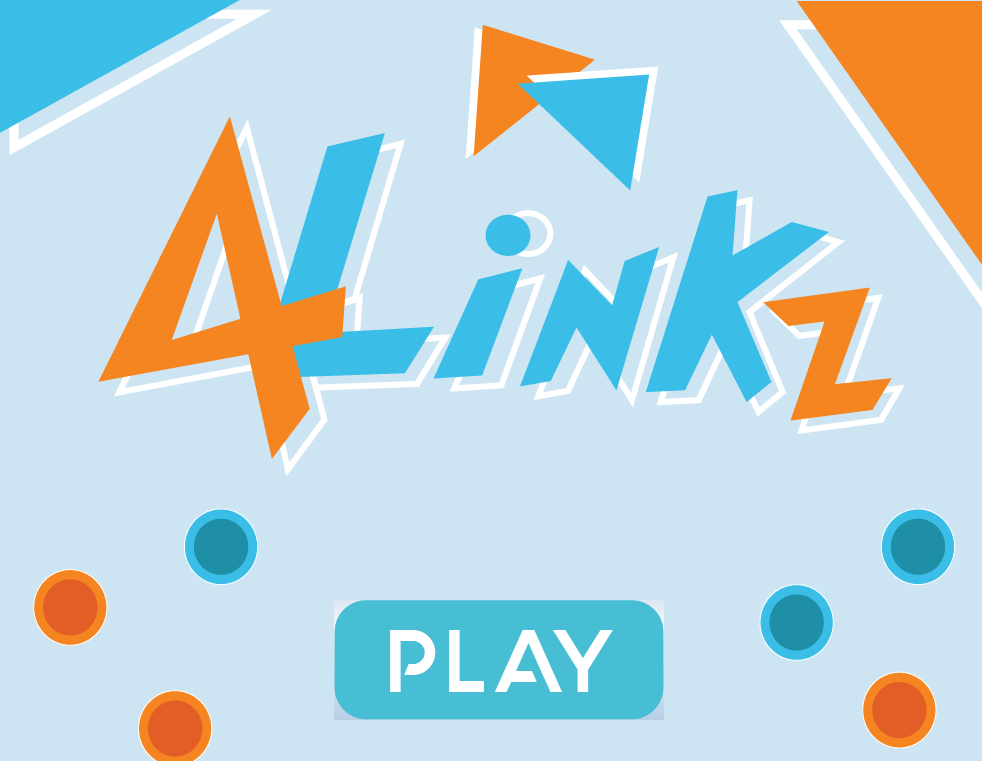

# 4Linkz
Connect 4 game with visually appealing GUI and music component.

Uses object oriented principles to modularize code into various components.

Note: Requires JAVAFX library to run in IntelliJ
___

## Objective:

The objective of this game is to have four tokens/pieces (of your own individual colour) aligned together in such a way that they form a straight line.

## Gameplay:

Players take turns dropping tokens* of their colour in a 7 by 7 grid.

The game concludes when the first player clears the objective fore-mentioned earlier.

Player 1 begins the game and is allowed to drop the first token.

Player 1 is represented by Orange and Player 2 is represented by Blue.

*Dropping tokens follows gravity physics in which tokens will drop to the first available location in the selected column.

## Controls/How to Play:

The are there 3 main controls in playing 4LinkZ.

To select between columns, alternate pressing the 'Left Arrowkey' and the 'Right Arrowkey'.

When dropping your token, press 'Space'.

### There are additional buttons on the side:

'Reroll Song' - Changes the current played background song to the next one on the list.

'Reset Game' - Resets the board pieces and allows the users to continue playing additional rounds.
___

